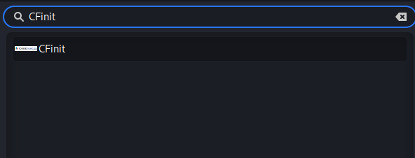
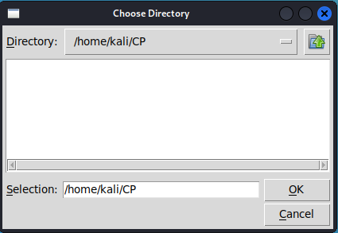
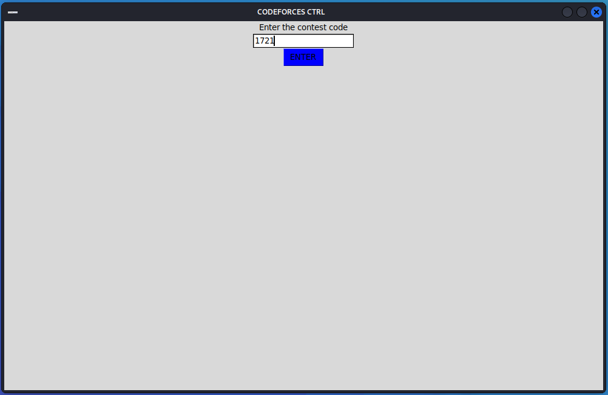
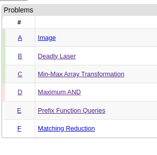
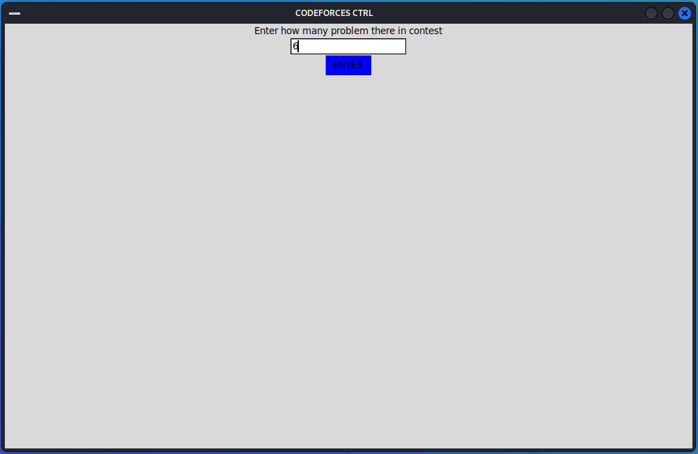
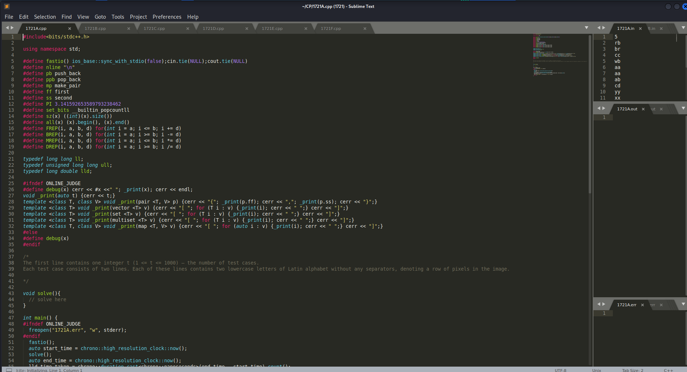

<p align="center">
  <a href="https://codeforces.com/" target="blank"></a>
</p>


## Description

[CFinit](https://github.com/ANISUL-ISLAM-ONI/CFinit) is a small contribution towards the open source community and competitive programming community. This is a script for automation of Codeforces rounds. There is no need to manually copy input from problem description, this script does it for you for every single problem of a cf round and creates c++ code template for corresponding problems. Input description is also included into your source code in a commented form so that you don't need to go back and forth from problem description to code editor. Here I used Sublime Text 3 as a code editor. This is just an initiative, there is more to improve and automation. If you have any suggestion or find any kind of error in code (which is absolutely normal to find), feel free to let me know or contribute independently. Looking forward for this initiative:
- Multi-platform compatibility (For now only for linux)
- All segment of input collection and automation for every segment for testing
- Graphically more attractive and more user friendly
- Compatible for every popular code editor
- Customizable code editor for only Competitive Programming (If it is possible), where problem statements show in a window of the code editor in embedded form not in browser.
- Compatible for all popular Online Judges.


## Installation
### Install Sublime Text
```
$ wget -qO - https://download.sublimetext.com/sublimehq-pub.gpg | gpg --dearmor | sudo tee /etc/apt/trusted.gpg.d/sublimehq-archive.gpg
$ echo "deb https://download.sublimetext.com/ apt/stable/" | sudo tee /etc/apt/sources.list.d/sublime-text.list
$ sudo apt-get update
$ sudo apt-get install sublime-text

# If this fails ensure apt is set up to work with https sources:
$ sudo apt-get install apt-transport-https
```
### Install GNU g++ (If not installed)
```
$ sudo apt-get install g++ gcc
```

### Install CFinit
```bash
$ git clone https://github.com/ANISUL-ISLAM-ONI/CFinit.git
$ cd CFinit
$ chmod +x script
$ sudo ./script install
```

## Uninstall

```bash
$ sudo ./script uninstall
```

## Running the app
You can run the program from terminal using command :
```bash
$ initcon
```
Or you can also run the program using app launcher<br><br>


## Use the app
Choose the folder you want to store codes<br><br>
<br><br>
Collect the contest number from codeforces round<br><br>
<br><br>
Enter the number into the program and click enter<br><br>
<br><br>
Determine how many problem there in contest<br><br>
<br><br>
Enter the problem count and click enter<br><br>
<br><br>
### Enjoy...


## Stay in touch

- Author - [Anisul Islam](https://github.com/ANISUL-ISLAM-ONI)
- Blog - [ONICODEX](https://onicodex.blogspot.com/)
- Twitter - [@ONICODEX](https://twitter.com/ONICODEX)

## License

CFinit is [GNU Public licensed](LICENSE).
